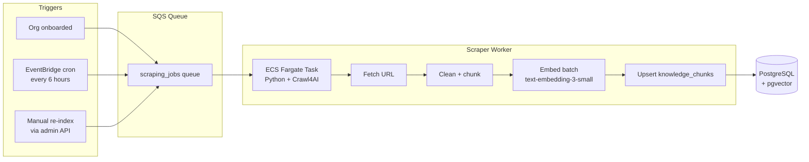
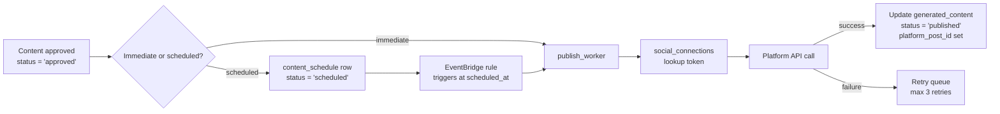

# Neki AI Content Agent — Architecture Plan

> **Observation vs. Assumption key used throughout this document**
> - **[OBS]** — directly observed in the repository code
> - **[ASS]** — assumed about the Neki platform (not observable from this repo)
> - **[REC]** — a recommendation

---

## 1. Current System Analysis

### What This Repository Actually Is

This repository is a **standalone Streamlit proof-of-concept** — not the Neki platform. It is a self-contained Python application that demonstrates the AI content generation concept. The Neki Next.js + Node.js codebase is a separate system not present in this repository.

### Observed Architecture (from code)

**Entry point** [OBS]: `app.py` — a single-file Streamlit application (~490 lines) handling UI, session state, and orchestration.

**LangGraph pipeline** [OBS]: Linear, stateless, no retry loop:
```
gather_context → generate_content → _route_image
                                        ├─ uploaded → optimize_image → finalize
                                        ├─ generate → image_prompt → generate_image → optimize_image → finalize
                                        └─ neither  → finalize
```

**Context gathering** [OBS]: Mutually exclusive — either the org website is scraped OR Tavily web search is run, never both simultaneously. Website scraping is truncated at 4,000 characters, Tavily returns 2 results at 150 characters each.

**LLM usage** [OBS]:
- `gpt-5.4-mini` — clarification chat, image prompt generation, post-generation edits
- `gpt-5.4` — main content generation (max_tokens=600)
- `gpt-image-2` — image generation (1024×1024, quality=low)

**Persistence** [OBS]: Zero. The only file written to disk is `data/usage.json` for IP-based rate limiting, which resets on redeploy on Streamlit Cloud.

**Authentication** [OBS]: None. The app has no user accounts. Rate limiting is IP-based only.

**Facebook publishing** [OBS]: OAuth 2.0 via Facebook Graph API v21.0. Posts text via `/{page_id}/feed` or image via `/{page_id}/photos`. Short-lived token upgraded to long-lived on connect.

**No database** [OBS]: No PostgreSQL, no Redis, no vector store, no embeddings.

**No RAG** [OBS]: No vector DB, no document indexing, no semantic search.

### Gaps Between POC and Production Requirements

| Capability | Current POC | Production Requirement |
|---|---|---|
| Authentication | None (IP only) | Multi-tenant, per-user |
| Persistence | File (ephemeral) | PostgreSQL |
| Context quality | 4k char truncated scrape | Semantic chunked retrieval |
| Scraping | Live, per-request | Async, scheduled, cached |
| Memory | None (session only) | Conversation + long-term |
| Multi-tenancy | None | tenant_id isolation |
| Social publishing | Facebook only | Multi-platform |
| Rate limiting | File-backed | Database-backed per tenant |
| Observability | LangSmith (optional) | Full trace + metrics |

### Assumptions About the Neki Platform

The following are assumed based on the business context, not observed:

- **[ASS]** Neki has existing `tenants`, `organizations`, `communities`, `users` tables in PostgreSQL.
- **[ASS]** Neki uses JWT or session-based authentication in its Node.js backend.
- **[ASS]** Neki's frontend uses Next.js with API routes or a separate API layer.
- **[ASS]** Neki is deployed on AWS (ECS, RDS, or similar).
- **[ASS]** Neki's PostgreSQL instance can have the `pgvector` extension enabled.
- **[ASS]** Neki's org/community pages contain structured content (mission, posts, updates).
- **[ASS]** Neki currently has no AI content generation capability.

---

## 2. Recommended Architecture

### Architectural Principle

**Do not rewrite Neki. Extend it.**

The AI agent is best deployed as a **separate Python microservice** (FastAPI) that Neki's Node.js backend calls via internal HTTP. This preserves existing auth, database ownership, and deployment patterns while isolating AI complexity.

```
┌─────────────────────────────────────┐
│         Next.js Frontend            │
│  (new: AI content generation UI)    │
└────────────┬────────────────────────┘
             │  API calls (existing pattern)
┌────────────▼────────────────────────┐
│       Node.js Backend (existing)    │
│  + new: /api/ai/* route handlers    │
│  + new: scraping job scheduler      │
└────────────┬────────────────────────┘
             │  internal HTTP
┌────────────▼────────────────────────┐
│     Python AI Agent Service         │
│     (FastAPI + LangGraph)           │
│     Deployed: ECS Fargate           │
└────────────┬────────────────────────┘
             │  reads/writes
┌────────────▼────────────────────────┐
│  PostgreSQL (existing RDS instance) │
│  + pgvector extension               │
│  + knowledge_chunks table           │
│  + conversation_sessions table      │
│  + generated_content table          │
└─────────────────────────────────────┘
```

### Why Python Microservice, Not Node.js

- LangGraph, LangChain, and the LLM ecosystem are Python-native. Running them in Node.js via subprocess or REST adds complexity.
- The AI service can be independently scaled, deployed, and updated.
- Keeps AI debt isolated from the main application.
- The Node.js backend calls the AI service like any other internal API.

---

## 3. Database Schema

All AI tables live in the existing PostgreSQL instance. The `pgvector` extension must be enabled once per database: `CREATE EXTENSION IF NOT EXISTS vector;`

### Core AI Tables

```sql
-- Enable vector extension (run once)
CREATE EXTENSION IF NOT EXISTS vector;

-- ─── Knowledge chunks ────────────────────────────────────────────────────────
-- The RAG knowledge base. One row per text chunk from any indexed source.
CREATE TABLE knowledge_chunks (
    id            UUID        PRIMARY KEY DEFAULT gen_random_uuid(),
    tenant_id     UUID        NOT NULL,   -- multi-tenancy isolation
    org_id        UUID,                   -- NULL = tenant-wide knowledge
    community_id  UUID,                   -- NULL = not community-specific
    source_url    TEXT,
    source_type   VARCHAR(50) NOT NULL,   -- 'org_website' | 'blog' | 'news' |
                                          -- 'pdf' | 'social' | 'manual'
    title         TEXT,
    chunk_text    TEXT        NOT NULL,
    chunk_index   INTEGER     NOT NULL DEFAULT 0,
    metadata      JSONB       NOT NULL DEFAULT '{}',
    content_hash  CHAR(16)    NOT NULL,   -- sha256[:16] for deduplication
    embedding     vector(1536),           -- text-embedding-3-small
    indexed_at    TIMESTAMPTZ NOT NULL DEFAULT NOW(),
    expires_at    TIMESTAMPTZ,            -- NULL = never expires
    UNIQUE (content_hash, tenant_id)
);

CREATE INDEX ON knowledge_chunks USING ivfflat (embedding vector_cosine_ops)
    WITH (lists = 100);
CREATE INDEX ON knowledge_chunks (tenant_id, org_id);
CREATE INDEX ON knowledge_chunks (tenant_id, source_type);
CREATE INDEX ON knowledge_chunks (tenant_id, expires_at)
    WHERE expires_at IS NOT NULL;

-- ─── Conversation sessions ────────────────────────────────────────────────────
CREATE TABLE conversation_sessions (
    id          UUID        PRIMARY KEY DEFAULT gen_random_uuid(),
    tenant_id   UUID        NOT NULL,
    user_id     UUID        NOT NULL,
    org_id      UUID,
    messages    JSONB       NOT NULL DEFAULT '[]',
    summary     TEXT,
    metadata    JSONB       NOT NULL DEFAULT '{}',
    created_at  TIMESTAMPTZ NOT NULL DEFAULT NOW(),
    updated_at  TIMESTAMPTZ NOT NULL DEFAULT NOW()
);

CREATE INDEX ON conversation_sessions (tenant_id, user_id);
CREATE INDEX ON conversation_sessions (updated_at DESC);

-- ─── Generated content library ───────────────────────────────────────────────
CREATE TABLE generated_content (
    id               UUID        PRIMARY KEY DEFAULT gen_random_uuid(),
    tenant_id        UUID        NOT NULL,
    user_id          UUID        NOT NULL,
    org_id           UUID,
    session_id       UUID        REFERENCES conversation_sessions(id),
    platform         VARCHAR(50),            -- 'linkedin' | 'facebook' | 'instagram' | 'x' | 'bluesky'
    content          TEXT        NOT NULL,
    image_url        TEXT,
    status           VARCHAR(50) NOT NULL DEFAULT 'draft',
                                             -- 'draft' | 'approved' | 'scheduled' | 'published' | 'archived'
    published_at     TIMESTAMPTZ,
    platform_post_id TEXT,
    metadata         JSONB       NOT NULL DEFAULT '{}',
    embedding        vector(1536),           -- enables style/voice retrieval
    created_at       TIMESTAMPTZ NOT NULL DEFAULT NOW(),
    updated_at       TIMESTAMPTZ NOT NULL DEFAULT NOW()
);

CREATE INDEX ON generated_content USING ivfflat (embedding vector_cosine_ops)
    WITH (lists = 50);
CREATE INDEX ON generated_content (tenant_id, org_id, status);
CREATE INDEX ON generated_content (tenant_id, user_id);

-- ─── Scraping job registry ────────────────────────────────────────────────────
CREATE TABLE scraping_jobs (
    id                    UUID        PRIMARY KEY DEFAULT gen_random_uuid(),
    tenant_id             UUID        NOT NULL,
    org_id                UUID,
    url                   TEXT        NOT NULL,
    source_type           VARCHAR(50) NOT NULL,
    status                VARCHAR(50) NOT NULL DEFAULT 'pending',
                                                -- 'pending' | 'running' | 'completed' | 'failed' | 'paused'
    last_scraped_at       TIMESTAMPTZ,
    next_scrape_at        TIMESTAMPTZ NOT NULL DEFAULT NOW(),
    scrape_frequency_hours INTEGER    NOT NULL DEFAULT 24,
    consecutive_failures  INTEGER     NOT NULL DEFAULT 0,
    error_message         TEXT,
    created_at            TIMESTAMPTZ NOT NULL DEFAULT NOW(),
    updated_at            TIMESTAMPTZ NOT NULL DEFAULT NOW(),
    UNIQUE (tenant_id, url)
);

CREATE INDEX ON scraping_jobs (next_scrape_at, status)
    WHERE status NOT IN ('paused', 'failed');

-- ─── Content publishing schedule ─────────────────────────────────────────────
CREATE TABLE content_schedule (
    id               UUID        PRIMARY KEY DEFAULT gen_random_uuid(),
    content_id       UUID        NOT NULL REFERENCES generated_content(id),
    tenant_id        UUID        NOT NULL,
    platform         VARCHAR(50) NOT NULL,
    platform_account_id TEXT,               -- which page/profile to post to
    scheduled_at     TIMESTAMPTZ NOT NULL,
    status           VARCHAR(50) NOT NULL DEFAULT 'scheduled',
    published_at     TIMESTAMPTZ,
    platform_post_id TEXT,
    error_message    TEXT,
    retry_count      INTEGER     NOT NULL DEFAULT 0,
    created_at       TIMESTAMPTZ NOT NULL DEFAULT NOW()
);

CREATE INDEX ON content_schedule (scheduled_at, status)
    WHERE status = 'scheduled';

-- ─── Social platform connections ──────────────────────────────────────────────
CREATE TABLE social_connections (
    id              UUID        PRIMARY KEY DEFAULT gen_random_uuid(),
    tenant_id       UUID        NOT NULL,
    org_id          UUID,
    user_id         UUID,
    platform        VARCHAR(50) NOT NULL,
    account_id      TEXT        NOT NULL,
    account_name    TEXT,
    access_token    TEXT        NOT NULL,   -- encrypt at rest
    refresh_token   TEXT,
    token_expires_at TIMESTAMPTZ,
    scopes          TEXT[],
    metadata        JSONB       NOT NULL DEFAULT '{}',
    created_at      TIMESTAMPTZ NOT NULL DEFAULT NOW(),
    updated_at      TIMESTAMPTZ NOT NULL DEFAULT NOW(),
    UNIQUE (tenant_id, platform, account_id)
);

-- ─── User AI preferences ──────────────────────────────────────────────────────
CREATE TABLE user_ai_preferences (
    user_id             UUID        PRIMARY KEY,
    tenant_id           UUID        NOT NULL,
    preferred_platforms TEXT[]      DEFAULT '{}',
    preferred_tone      VARCHAR(50) DEFAULT 'professional',
    default_org_id      UUID,
    metadata            JSONB       NOT NULL DEFAULT '{}',
    created_at          TIMESTAMPTZ NOT NULL DEFAULT NOW(),
    updated_at          TIMESTAMPTZ NOT NULL DEFAULT NOW()
);
```

---

## 4. pgvector Design

### Collections (Logical Separation via `source_type` + filters)

Rather than separate tables, a single `knowledge_chunks` table with metadata filtering handles all retrieval needs cleanly. Use IVFFlat index for approximate nearest-neighbor search.

### Index Strategy

```sql
-- For cosine similarity (recommended for text embeddings)
CREATE INDEX knowledge_chunks_embedding_idx
    ON knowledge_chunks
    USING ivfflat (embedding vector_cosine_ops)
    WITH (lists = 100);

-- Partial index for faster org-specific retrieval
CREATE INDEX knowledge_chunks_org_embedding_idx
    ON knowledge_chunks (tenant_id, org_id)
    WHERE org_id IS NOT NULL;
```

**IVFFlat vs. HNSW tradeoff**:
- IVFFlat: faster to build, lower memory, slightly less accurate — good for MVP
- HNSW: better recall, higher memory, slower to build — upgrade when corpus > 100k chunks

### Query Pattern

```sql
-- Retrieve top-5 chunks for a query, filtered by tenant + org
SELECT
    chunk_text,
    metadata,
    source_url,
    1 - (embedding <=> $1::vector) AS similarity_score
FROM knowledge_chunks
WHERE
    tenant_id = $2
    AND (org_id = $3 OR org_id IS NULL)   -- org-specific OR tenant-wide
    AND (expires_at IS NULL OR expires_at > NOW())
ORDER BY embedding <=> $1::vector
LIMIT 5;
```

### Embedding Model

**[REC]** Use `text-embedding-3-small` (1536 dimensions, $0.02/1M tokens). Consistent with the existing POC codebase. Do not mix embedding models within a collection — if you upgrade models, re-embed all chunks.

---

## 5. LangGraph Workflow

### Updated State Schema

```python
class NekiAgentState(BaseModel):
    # Identity (set by API layer — never derived inside the graph)
    tenant_id: str
    user_id: str
    org_id: Optional[str] = None
    session_id: Optional[str] = None

    # User request
    original_query: str = ""
    clarification_context: str = ""
    target_platform: Optional[str] = None  # detected or user-specified
    generate_image: bool = False
    uploaded_image_bytes: Optional[bytes] = None

    # Retrieved context
    org_context: str = ""             # from knowledge_chunks (org website)
    web_context: str = ""             # from Tavily (live, supplementary)
    retrieved_chunks: list[str] = []  # formatted RAG results
    retrieval_sources: list[str] = []
    conversation_history: list[dict] = []

    # Generation
    generated_content: str = ""
    image_prompt: str = ""
    image_bytes: Optional[bytes] = None

    # Output
    final_content: str = ""
    session_id_out: Optional[str] = None  # session created/updated during this run
    error: Optional[str] = None
```

### Node Responsibilities

```mermaid
graph TD
    A[User Request<br/>via API] --> B[load_session<br/>restore conversation history]
    B --> C[classify_intent<br/>detect platform, tone hints]
    C --> D[retrieve_context<br/>pgvector semantic search]
    D --> E[retrieve_web<br/>Tavily — only if needed]
    E --> F[generate_content<br/>gpt-5.4 with full context]
    F --> G{needs_image?}
    G -->|yes — AI gen| H[generate_image_prompt]
    G -->|yes — uploaded| I[optimize_image]
    G -->|no| K[save_session<br/>persist conversation + content]
    H --> J[generate_image]
    J --> I
    I --> K
    K --> L[Final Response]

    style D fill:#1a2e1a,stroke:#22c55e
    style B fill:#1a2e1a,stroke:#22c55e
    style K fill:#1a2e1a,stroke:#22c55e
```



### Node Descriptions

| Node | Inputs from State | Writes to State | Notes |
|---|---|---|---|
| `load_session` | `session_id`, `tenant_id`, `user_id` | `conversation_history` | Load last N messages from DB |
| `classify_intent` | `original_query`, `conversation_history` | `target_platform`, clarification flags | Fast gpt-5.4-mini call; picks LinkedIn/Facebook/Instagram |
| `retrieve_context` | `original_query`, `tenant_id`, `org_id` | `retrieved_chunks`, `retrieval_sources`, `org_context` | pgvector query; no LLM call |
| `retrieve_web` | `original_query`, `retrieved_chunks` | `web_context` | Skip if org context is rich enough; Tavily |
| `generate_content` | All context fields | `generated_content` | Main gpt-5.4 call; uses all retrieved context |
| `generate_image_prompt` | `original_query`, `generated_content` | `image_prompt` | Fast gpt-5.4-mini call |
| `generate_image` | `image_prompt` | `image_bytes` | gpt-image-2 call |
| `optimize_image` | `uploaded_image_bytes` or `image_bytes` | `image_bytes` | Pillow normalize + resize |
| `save_session` | All state | `session_id_out` | Persist conversation + generated content to DB |

---

## 6. Data Collection Architecture

### Design Principle

**All scraping happens asynchronously before user requests.** No live scraping during generation.

The flow is:
1. When an org is onboarded in Neki, a scraping job is registered.
2. A cron-triggered worker picks up pending jobs from `scraping_jobs`.
3. Scraped content is chunked, embedded, and stored in `knowledge_chunks`.
4. During generation, the agent queries the pre-built index — no live HTTP calls to org sites.

### Scraper Evaluation

| Tool | Type | JS Support | Cost | Best For | Verdict |
|---|---|---|---|---|---|
| **Crawl4AI** | Open-source, async Python | Yes (Playwright) | Free | Org websites, structured extraction | **Recommended for MVP** |
| **Firecrawl** | SaaS API | Yes | $15+/mo | JS-heavy sites, markdown output | Use as fallback for complex sites |
| **Playwright** | Low-level browser automation | Yes | Free (infra cost) | Custom scraping, login-required | Too much code for MVP |
| **Apify** | Enterprise SaaS | Yes | $49+/mo | High-volume, many site types | Overkill |

**[REC]** Use **Crawl4AI** as the primary scraper. It is async, Docker-deployable, outputs clean markdown, handles JavaScript via an embedded Playwright instance, and costs nothing. Use Tavily for real-time web search during generation (current POC pattern is already correct for this).

### Scraping Architecture



### Crawl Frequency Strategy

| Source Type | Frequency | Rationale |
|---|---|---|
| Org website | Every 24 hours | Content changes infrequently |
| Org blog / news | Every 6 hours | More frequent updates |
| Community pages | Every 12 hours | Moderate change rate |
| External news | Every 3 hours | News is time-sensitive |
| Social media | Daily (if API allows) | Rate-limit constrained |

---

## 7. Memory Architecture

### Two Layers

**Layer 1 — Conversation Memory (short-term)**

Stored in `conversation_sessions.messages` as a JSONB array. On each request, the `load_session` node fetches the last 10 messages. On each response, `save_session` appends the new exchange and, if the session exceeds 20 messages, creates a rolling summary using gpt-5.4-mini.

```json
{
  "messages": [
    {"role": "user", "content": "...", "ts": "2026-06-12T10:00:00Z"},
    {"role": "assistant", "content": "...", "ts": "2026-06-12T10:00:05Z"}
  ],
  "summary": "User is creating LinkedIn posts for Org X's annual fundraising campaign..."
}
```

**Layer 2 — Long-Term Memory (semantic)**

Stored in `generated_content` with embeddings in the `embedding` column. When generating new content, the retrieval node can optionally query past content for the same org to match voice and style.

```sql
-- Retrieve the 3 most stylistically similar past posts
SELECT content, platform, created_at
FROM generated_content
WHERE tenant_id = $1
  AND org_id = $2
  AND status NOT IN ('archived')
ORDER BY embedding <=> $3::vector
LIMIT 3;
```

### Memory Flow in Graph

```
load_session
  → reads conversation_sessions for session_id
  → writes conversation_history to state

retrieve_context
  → queries knowledge_chunks (org knowledge)
  → optionally queries generated_content (past posts for style)

save_session
  → upserts conversation_sessions (messages + summary)
  → inserts generated_content row
  → if embedding not set, embed and update the row async
```

---

## 8. Social Media Publishing Architecture

**[REC]** Do not build publishing now. Design the schema and API contracts so publishing can be layered on without schema changes.

### Platform Integration Map

| Platform | API | OAuth | Notes |
|---|---|---|---|
| **Facebook** | Graph API v21.0 | OAuth 2.0 | Already implemented in POC |
| **LinkedIn** | LinkedIn API v2 | OAuth 2.0 | UGC Posts API |
| **Instagram** | Instagram Graph API | OAuth 2.0 (via Facebook) | Requires Facebook App |
| **X (Twitter)** | X API v2 | OAuth 2.0 | Free tier: 1,500 posts/month |
| **Bluesky** | AT Protocol (atproto) | App passwords | No OAuth yet |

### Publishing Flow (Future)



### Approval Workflow (Optional)

Add a `status` transition: `draft → pending_approval → approved → scheduled → published`.

The Node.js backend handles the approval UI and state machine. The AI service only sets `draft`. Publishing is triggered by the Node.js layer after approval.

---

## 9. AWS Architecture

### MVP Architecture

Principle: smallest footprint that works. Leverage existing RDS and ECS if Neki already uses them.

```
┌──────────────────────────────────────────────────────────────────┐
│  AWS Account                                                      │
│                                                                   │
│  ┌─────────────┐    ┌──────────────────┐    ┌────────────────┐  │
│  │  CloudFront │    │  ALB             │    │  ECS Fargate   │  │
│  │  (Next.js)  │───▶│  (Node.js API)   │───▶│  AI Service    │  │
│  └─────────────┘    └──────────────────┘    │  (FastAPI)     │  │
│                                              └───────┬────────┘  │
│                                                      │           │
│  ┌───────────────────────────────────────────────────▼────────┐  │
│  │  RDS PostgreSQL (existing)                                  │  │
│  │  + pgvector extension                                       │  │
│  └─────────────────────────────────────────────────────────────┘  │
│                                                                   │
│  ┌─────────────────┐    ┌──────────────────┐                     │
│  │  EventBridge    │───▶│  SQS             │                     │
│  │  Cron rules     │    │  scraping_jobs   │                     │
│  └─────────────────┘    └────────┬─────────┘                     │
│                                  │                               │
│                         ┌────────▼─────────┐                     │
│                         │  ECS Fargate      │                     │
│                         │  Scraper Worker   │                     │
│                         └──────────────────┘                     │
└──────────────────────────────────────────────────────────────────┘
```

**MVP services**:
- **RDS PostgreSQL** (existing) + pgvector extension
- **ECS Fargate** — AI agent service (FastAPI, ~1 task, auto-scaling 1–4)
- **ECS Fargate** — Scraper worker (separate task definition, scale to 0 when idle)
- **SQS Standard Queue** — decouples scraping job dispatch from execution
- **EventBridge Scheduler** — triggers scraping cron every 6 hours
- **ALB** — routes Node.js → AI service internally (private subnet only)
- **ECR** — container registry for both services
- **Secrets Manager** — API keys, DB credentials, social platform tokens

**Not needed for MVP**:
- Step Functions (cron + SQS is sufficient)
- ElastiCache (pgvector query cache is fast enough)
- Lambda (not suitable for long-running LLM calls)

### Scalable Production Architecture

Add as load grows:

| Component | MVP | Production |
|---|---|---|
| AI Service | 1–4 Fargate tasks | 4–20 tasks, horizontal scaling |
| Scraper | 1 task, cron | Multiple workers, SQS concurrency |
| DB connections | Direct RDS | RDS Proxy (connection pooling) |
| Embeddings | Per-request | Batch + ElastiCache for repeated queries |
| Async jobs | Sync in-request | SQS for session save, content embedding |
| Observability | LangSmith | LangSmith + CloudWatch + X-Ray |

---

## 10. Security Architecture

### Multi-Tenancy Isolation

Every query to `knowledge_chunks`, `generated_content`, `conversation_sessions` **must** include `WHERE tenant_id = $1`. This is enforced at the database query layer in the AI service — the `tenant_id` is extracted from the JWT passed by the Node.js backend and injected into every agent state before the graph runs.

**[REC]** Use PostgreSQL Row Level Security (RLS) as a defense-in-depth measure:

```sql
ALTER TABLE knowledge_chunks ENABLE ROW LEVEL SECURITY;

CREATE POLICY tenant_isolation ON knowledge_chunks
    USING (tenant_id = current_setting('app.tenant_id')::uuid);
```

The AI service sets `SET LOCAL app.tenant_id = '<id>'` at the start of each transaction.

### Prompt Injection Defense

Uploaded documents or scraped web content can contain adversarial instructions. Mitigations:

1. **Sanitize scraped content** before embedding — strip patterns like `ignore previous instructions`, `system:`, `<|im_start|>` using a regex blocklist.
2. **Wrap retrieved context in a labeled separator** in the system prompt — the current POC already does this correctly with the `org_block` pattern.
3. **Never concatenate raw user-uploaded text directly into a `SystemMessage`** — always use `HumanMessage` or a clearly delimited `[DOCUMENT]...[/DOCUMENT]` block.
4. **Model-level**: OpenAI's models have built-in resistance to many injection patterns.

### Token Storage

Social platform access tokens stored in `social_connections.access_token` must be encrypted at rest. Options:
- AWS KMS + application-layer encryption before DB insert
- PostgreSQL pgcrypto extension
- **[REC]** Store in Secrets Manager if per-tenant token count is low; encrypt in-column with KMS if high volume.

### Rate Limiting

Replace the current IP-based file-backed limiter with:
- Per-user daily generation limits stored in `user_ai_preferences.metadata`
- Enforced in the Node.js API layer before calling the AI service
- Tenant-level aggregate limits enforced at the AI service layer

---

## 11. MVP Roadmap

### Week 1 — Foundation

- [ ] Enable pgvector on existing RDS instance
- [ ] Create all AI tables (migration script)
- [ ] Stand up FastAPI AI service in Docker
- [ ] Port LangGraph pipeline from Streamlit to FastAPI endpoint
- [ ] Implement `retrieve_context` node (pgvector query)
- [ ] Implement `load_session` and `save_session` nodes

### Week 2 — Ingestion

- [ ] Implement scraping worker with Crawl4AI
- [ ] Implement chunking + embedding pipeline
- [ ] Connect SQS queue to worker
- [ ] Register scraping job when org website is entered
- [ ] Test end-to-end: scrape → embed → retrieve → generate

### Week 3 — Neki Integration

- [ ] Add `/api/ai/generate` endpoint to Node.js backend (proxies to AI service)
- [ ] Add `/api/ai/sessions/:id` for conversation history
- [ ] Add JWT propagation from Node.js → AI service (tenant_id, user_id injection)
- [ ] Build Next.js UI component for the content generation chat

### Week 4 — Polish + Deploy

- [ ] ECS task definitions + ECR for both services
- [ ] EventBridge cron for scraper
- [ ] Secrets Manager for API keys
- [ ] LangSmith tracing enabled
- [ ] Rate limiting wired up
- [ ] Load test: verify pgvector query latency < 200ms at 10k chunks

---

## 12. Production Roadmap

### Phase 2 (Month 2)

- Multi-platform social publishing (LinkedIn first, then Instagram/X)
- Approval workflow UI in Next.js
- Content scheduling with EventBridge
- Brand guidelines PDF upload + indexing
- Content library memory (style retrieval from past posts)

### Phase 3 (Month 3+)

- Analytics storage for published content performance
- A/B content variant generation
- Organization-level tone/voice profile stored and retrieved
- Auto-refresh stale knowledge chunks (exponential backoff on failures)
- RDS Proxy for connection pooling under load
- HNSW index migration when corpus exceeds 100k chunks

---

## 13. Risks

| Risk | Likelihood | Impact | Mitigation |
|---|---|---|---|
| pgvector query latency too high at scale | Medium | High | IVFFlat index, partial indexes, query profiling |
| LLM API rate limits during peak | Medium | Medium | Request queuing, exponential backoff, LangSmith alerting |
| Scraped content contains injection attempts | Low | High | Sanitization pipeline, labeled context blocks |
| Token/secret leakage across tenants | Low | Critical | RLS, tenant_id in every query, KMS encryption |
| Stale knowledge base after org website update | Medium | Medium | 24h re-scrape + manual re-index endpoint |
| OpenAI pricing increase | Low | Medium | Embedding model is swappable; abstract behind `get_embeddings()` |
| Streamlit POC patterns leaking into production | High | Medium | Explicitly port to FastAPI; do not adapt the Streamlit app |

---

## 14. Cost Considerations

### Per-request costs (approximate)

| Component | Cost/request |
|---|---|
| Content generation (gpt-5.4, 600 tokens out) | ~$0.01–0.02 |
| Clarification (gpt-5.4-mini) | ~$0.001 |
| Image generation (gpt-image-2, 1024×1024) | ~$0.02 |
| Embedding query (text-embedding-3-small, 100 tokens) | $0.000002 |
| pgvector search | ~$0.00001 (compute) |
| **Total per generation (text only)** | **~$0.01–0.02** |
| **Total per generation (with image)** | **~$0.03–0.04** |

### Infrastructure costs (AWS, monthly)

| Component | MVP | Notes |
|---|---|---|
| ECS Fargate (AI service, 1–4 tasks) | $30–80 | 0.25 vCPU / 0.5 GB per task |
| ECS Fargate (Scraper, cron) | $5–15 | Scales to 0 when idle |
| RDS PostgreSQL | $0 | Existing instance |
| SQS | $1 | ~1M messages/month free tier |
| EventBridge | $0 | ~10K invocations/month free |
| ECR | $1 | Storage only |
| ALB | $20 | If new; $0 if existing |
| **MVP total infra** | **~$60–120/mo** | Excluding existing RDS/ALB |

Knowledge base indexing costs (one-time per org): < $0.01 for a typical nonprofit website.
