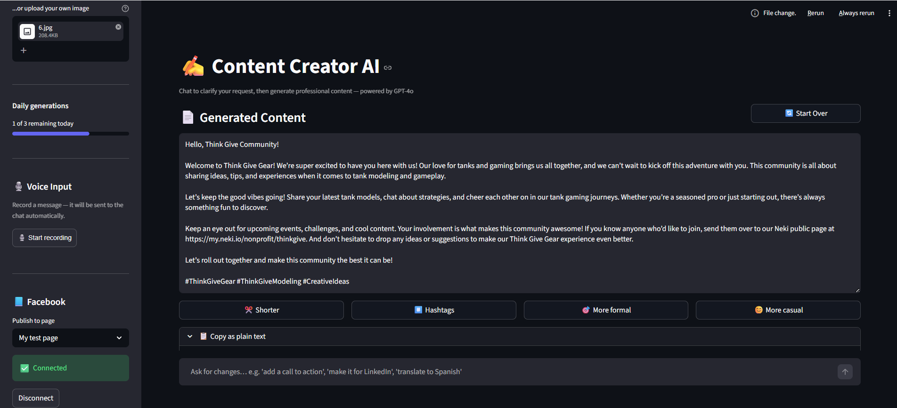

# Content Creator Agentic AI

A Streamlit-based AI agent that generates professional content (text + image) for nonprofits and associations. Built with LangGraph, LangChain, and OpenAI — with LangSmith observability built in.

---

## Screenshot

<!-- Add a screenshot of the app here -->
<!-- To add: take a screenshot, save it as docs/screenshot.png, then replace the line below -->


---

## Features

- **Multimodal input** — type your request or click the inline mic button to speak; voice is transcribed via Whisper and placed directly in the query box
- **Query refinement** — automatically sharpens your raw query before generation
- **Web search inspiration** — pulls in relevant context via Tavily search
- **Org context** — scrapes your organization's website to match tone and mission
- **Evaluation loop** — a judge LLM validates the output; retries up to 3 times if it fails
- **Image generation** — optional `gpt-image-1-mini` image, optimized for social media (Instagram, LinkedIn, Facebook)
- **Streaming output** — content streams character-by-character for a smooth UX
- **IP-based rate limiting** — 3 generations per IP per day with a graceful reset message
- **LangSmith observability** — every agent run is traced with per-node latency, token usage, and run metadata

---

## Agent Flow

```
User Input (text / voice via mic)
        │
        ▼
  Gather Context
  (Tavily web search + org website scrape)
        │
        ▼
  Query Refinement LLM  ◄──────────────────┐
  (gpt-4o-mini)                             │
        │                                   │ FAIL (max 3 retries)
        ▼                                   │
  Build Dynamic Prompt                      │
  (pure Python — no LLM)                   │
        │                                   │
        ▼                                   │
  Content Generation LLM                   │
  (gpt-4o)                                 │
        │                                   │
        ▼                                   │
  Evaluator LLM ──────────────────────────►┘
  (gpt-4o-mini · structured output)
        │ PASS
        ▼
  Generate Image? (yes/no)
        │ YES                      NO
        ▼                           ▼
  Image Prompt LLM             Finalize
  (gpt-4o-mini)
        │
        ▼
  Image Optimizer LLM
  (gpt-4o-mini)
        │
        ▼
  gpt-image-1-mini Image Generation
        │
        ▼
  Response (content + image)
```

---

## Tech Stack

| Layer | Technology |
|---|---|
| UI | Streamlit `>=1.37` |
| Agent Orchestration | LangGraph |
| LLM Abstraction | LangChain (`ChatOpenAI`) |
| Content Generation | OpenAI `gpt-4o` |
| Refinement / Evaluation / Image Prompts | OpenAI `gpt-4o-mini` |
| Image Generation | OpenAI `gpt-image-1-mini` |
| Speech-to-Text | OpenAI Whisper (`whisper-1`) |
| Web Search | Tavily Search API |
| Org Website Scraping | BeautifulSoup + httpx |
| Observability | LangSmith |
| Rate Limiting | IP-based · file-backed (`data/usage.json`) |

---

## Project Structure

```
content-creation-ai-agent/
├── app.py                  # Streamlit UI entry point
├── requirements.txt
├── .env                    # API keys — git-ignored
├── .env.example            # Template for environment variables
├── .gitignore
└── agent/
    ├── __init__.py
    ├── state.py            # AgentState Pydantic model
    ├── graph.py            # LangGraph workflow + conditional edges
    ├── nodes.py            # One ChatOpenAI-based function per agent node
    ├── tools.py            # Tavily search + BeautifulSoup scraper
    └── usage.py            # IP-based daily generation limit tracker
```

---

## Setup

### 1. Clone and install dependencies

```bash
git clone <repo-url>
cd content-creation-ai-agent
pip install -r requirements.txt
```

### 2. Configure environment variables

Copy `.env.example` to `.env` and fill in your keys:

```bash
cp .env.example .env
```

```env
# Required
OPENAI_API_KEY=sk-...
TAVILY_API_KEY=tvly-...

# Optional — daily generation cap per IP (default: 3)
DAILY_GENERATION_LIMIT=3

# LangSmith observability (optional but recommended)
LANGCHAIN_TRACING_V2=true
LANGCHAIN_ENDPOINT=https://api.smith.langchain.com
LANGCHAIN_API_KEY=ls__...
LANGCHAIN_PROJECT=content-creator-ai-agent
```

| Key | Where to get it |
|---|---|
| `OPENAI_API_KEY` | [platform.openai.com/api-keys](https://platform.openai.com/api-keys) |
| `TAVILY_API_KEY` | [app.tavily.com](https://app.tavily.com) — free tier available |
| `LANGCHAIN_API_KEY` | [smith.langchain.com](https://smith.langchain.com) → Settings → API Keys |

### 3. Run the app

```bash
streamlit run app.py
```

The app opens at `http://localhost:8501`.

---

## Usage

1. **Optionally** paste your organization's website URL in the sidebar for tone/context matching.
2. **Toggle image generation** if you want an AI-generated image alongside the content.
3. **Type your request** in the query box, or **click the 🎙️ mic button** (bottom-left of the box) to speak — your words are transcribed and placed in the box automatically.
4. Click **Generate Content** and watch the agent work step by step.
5. Edit or copy the streamed output; download the image if one was generated.

### Example prompts

```
Write a LinkedIn post announcing our annual fundraising gala for animal rescue,
targeting donors aged 30-50.

Write an Instagram caption about our upcoming community clean-up event
for our environmental nonprofit.

Create a Facebook post celebrating 10 years of our youth mentorship program.
```

---

## Rate Limiting

Each visitor is identified by their IP address. The daily generation cap defaults to **3 per day** and resets at midnight. When the limit is reached the app shows a friendly message with the exact reset time. Change the cap via `DAILY_GENERATION_LIMIT` in `.env`.

---

## Observability (LangSmith)

When `LANGCHAIN_TRACING_V2=true` is set, every agent run is automatically traced in LangSmith. Each trace includes:

- Full node-by-node breakdown (Gather Context → Refine → Generate → Evaluate → Image)
- Token counts and latency per node
- Run metadata: user IP, query preview, image flag, org context flag
- Tags: `content-agent`, `streamlit`

---

## Non-Functional Behaviour

| Concern | Behaviour |
|---|---|
| **Latency** | 5–10 s (text only) · 15–25 s (with image) |
| **Streaming** | Content renders character-by-character |
| **Timeout** | 120 s hard limit with graceful error message |
| **Retry loop** | Evaluator retries up to 3 times; best result returned on max-retry |
| **Guardrails** | OpenAI content policy enforced at the API level |
| **Voice input** | Browser mic via `streamlit-mic-recorder`; Whisper transcription |

---

## Out of Scope (future work)

- RAG / vector database for storing and reusing past content
- User authentication and persistent session history
- Direct social media publishing integration
- Multi-language support
